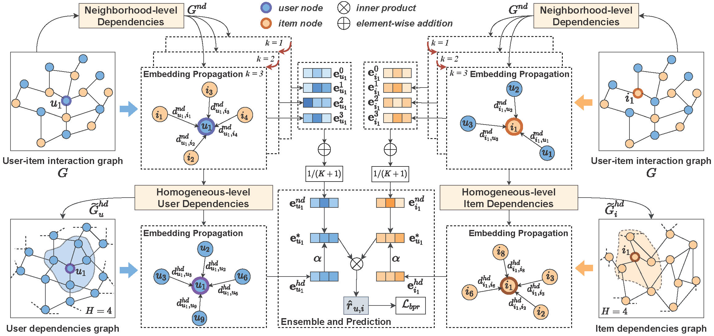

## MDGCF
This is the implementation for our CIKM 2022 paper:
>Guohui Li, Zhiqiang Guo, Jianjun Li, Chaoyang Wang. MDGCF: Multi-Dependency Graph Collaborative Filtering with Neighborhood- and Homogeneous-level Dependencies. In CIKM 2022. [Paper](https://dl.acm.org/doi/10.1145/3511808.3557390)

### Introduction
In this work, we propose a novel **Multi-Dependency Graph Collaborative Filtering (MDGCF)** model, which mines the neighborhood- and homogeneous-level dependencies to enhance the representation power of graph-based CF models. As shown in the framework, MDGCF mainly consists of three modules. First, a neighborhood-level dependencies graph learning (*NDGL*) module is utilized to capture the dependency relationships between nodes and their neighbors. Second, a homogeneous-level dependencies graph learning (*HDGL*) module is designed to mine the homogeneous-level dependencies information by building and processing the user-user and item-item dependencies graphs. Finally, the representations of users and items separately generated by NDGL and HDGL are fused to predict the preference of users for items.



### Environment
pip install -r requirements.txt

### Run
We provide three processed datasets: AKindle, AMusic and Gowalla, you can run train.sh to train the model MDGCF on three datasets:
```
bash train.sh
```
You also can set different parameters to train this model.

